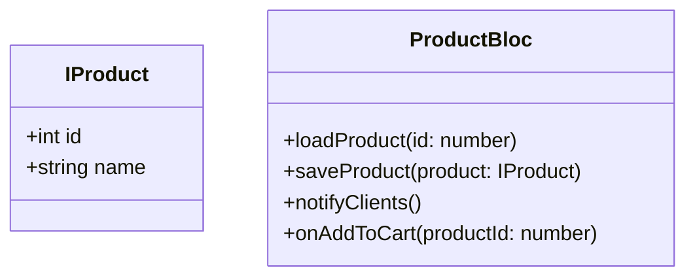
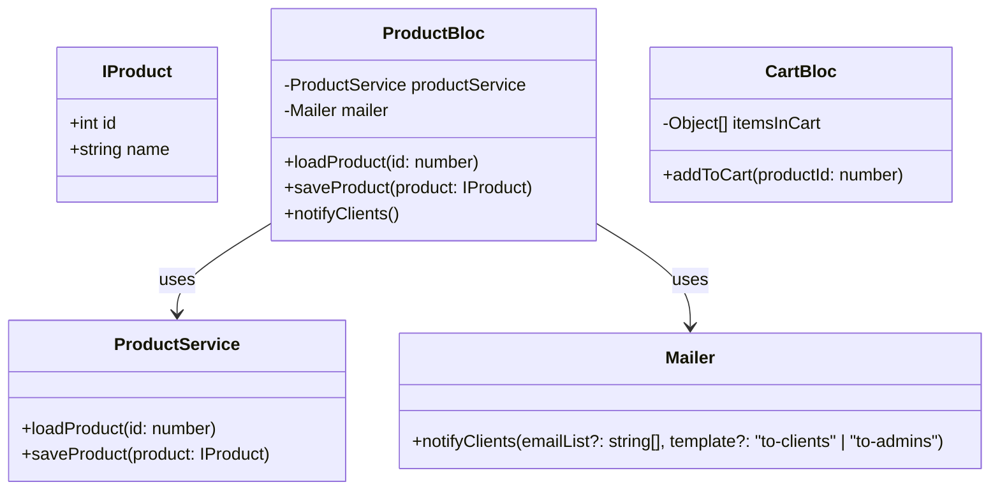

# 5 SOLID principles

## __Single Responsability (SRP)__

Is when we separate the responsibilities of each module. just keep in mind that `'single responsability' !== 'do more than one thing'`.

A good example would be this class that have too many responsibilities:

> [!NOTE]
> To clarify, `IProduct` is an `interface` in TS, not a class. I add it like that because that's the limitation that mermaid has right know if you want to make diagrams with TS. And `BLoC` means _Business Logic Component_.

Why do we have a `notifyClients()`? the class should only handle product responsibilities, and why `onAddToCart(productId: number)` is there? and what is we want to use the methods of `loadProduct(id: number)` and `saveProduct(product: Product)` somewhere else? That would cause a lot of issues in the future.

That's when when we use the SRP to separate responsibilities between our code.



You can see where that now `CartBloc` is being responsable to handle `onAddToCart()` and we even rename it to `addToCart()` to a single name since it's easier to understand under that context. Also `Mailer` is responsable to `notifyClients()` and we separated `ProductService` to make it easier to reuse somewhere else and not depend on `ProductBloc` for all our cases.

### How to know when is not being?
- Too generic names and very generic modules
- Changes in code that usually affect clases or modules
- Classes with multiple layers
- High number of importations
- High number of public methods
- Excessive number of code lines

## __Open/Closed Principle (OCP)__
This principle implies that software entities(clases, modules, methods, etc) __must be open for extension and close for modification__.  

In the next code we've classes consume data from an API, we've applied the SRP, so we've different services.
```ts
import { PhotosService, PostService, TodoService } from './services';

    const todoService = new TodoService();
    const postService = new PostService();
    const photosService = new PhotosService();

    const todos = await todoService.getTodoItems();
    const posts = await postService.getPosts();
    const photos = await photosService.getPhotos();
```
But the issue is that we're using a library to consume those endpoints, let's say we want to  migrate to fetch, we'd have to change every class. And let's say that maybe we want to comeback to `axios` again in the future so we'd have to implement it in very class again.

```ts
import axios from 'axios';

export class TodoService { 
    async getTodoItems() {
        const { data } = await axios.get('https://jsonplaceholder.typicode.com/todos/');
        return data;
    }
}

export class PostService {
    async getPosts() {
        const { data } = await axios.get('https://jsonplaceholder.typicode.com/posts');
        return data;
    }
}

export class PhotosService {
    async getPhotos() {
        const { data } = await axios.get('https://jsonplaceholder.typicode.com/photos');
        return data;
    }
}
```

So the solution would to create a separate class to implement our library.
```ts
import axios from "axios";

export class HttpClient {
  async get(url: string) {
    const { data, status } = await axios.get(`${url}`);
    return data;
  }
}
```

Now we use a DI (Dependency Injection) to also not make it tightly coupled and implement our `HttpClient`.

```ts
import axios from "axios";
import { HttpClient } from "./HttpClient";

export class TodoService {
  constructor(private http: HttpClient) {}

  async getTodoItems() {
    const { data } = await this.http.get(
      "https://jsonplaceholder.typicode.com/todos/"
    );
    return data;
  }
}

export class PostService {
  constructor(private http: HttpClient) {}

  async getPosts() {
    const { data } = await this.http.get(
      "https://jsonplaceholder.typicode.com/posts"
    );
    return data;
  }
}

export class PhotosService {
  constructor(private http: HttpClient) {}

  async getPhotos() {
    const { data } = await this.http.get(
      "https://jsonplaceholder.typicode.com/photos"
    );
    return data;
  }
}
```

We've to implement it when we instantiate a class. 
```ts
const http = new HttpClient();

const todoService = new TodoService(http);
const postService = new PostService(http);
const photosService = new PhotosService(http);
```

And now in the future we want to migrate to `fetch` we can do it very simple, like this.
```ts
export class HttpClient {
  async get(url: string) {
    const resp = await fetch(`${url}`);
    const data = await resp.json();

    return data;
  }
}
```

And our classes won't be affected by this change!! Since we applied a DI and we use `this.http.get` to consume the API.
```ts
constructor(private http: HttpClient) {}
```

```ts
const { data } = await this.http.get("some url");
```

Also we can conclude that SRP and OCP are very related.

### How to know when is not being?
- Changes usually affect our class or module
- When a class or module have a lot of layers. (Presentation, storage, etc) 

## __Liskov Substitution Principle (LSP)__
## __Interface Segregation Principle (ISP)__
## __Dependency Inversion Principle (DIP)__

# Code smells
The are 6 smells to avoid; remember the acronym `STUPID`:
- __Singleton__ : Global context, untraceable, can be modified from anywhere, any time and it's hard to test.
- __Tight Coupling__ : High interconection, hard to test, hard to scale or modify.
- __Untestability__ : Not adding unittesting. Also it becomes hard to test when we've in your code high coupling, singleton and non DI(dependencies injections)
- __Premature optimization__ : It's better to keep the options open, don't anticipate to the requirements and don't add unnecessary abstractions. 
- __Indescriptible names__ : Don't bee too specific or too generic. Use the right names for what you want the class to do.
- __Duplicity__ : When you copy a lot of code it's a sign. Non using DRY, creates more human error, creates more testing for the same things, can lead to different behaviors with the same code accidentally because we modify some code and think it's also use in other places, where is not.

# Clean code
- Name correctly
- Use DRY
- Use single responsibility/reduce coupling

# Other smells
## Inflation  
- Use small functions instead of one big function
- Use small classes instead of one big class
- Primitive obsession instead of using a class/interface. This happens because the object grew too much.
- Long parameter list. Use submethods instead if these are required, like sending an object or multiple ones instead of multiple parameters.

## Couplers
- Feature envy. Change of place the attributes and methods.
- Don't use internal method or attributes of other classes.
- Chain of messages. It's when class `A` calls `B` to use the function of `C` to get the result of `A` again or `D`. Try to eliminate the communication between middle classes.
- Remove the middleman. It can happen in a incomplete refactorization or a bad design pattern.

# Project for Practice

This is a Vanilla TypeScript project in Vite, to work on exercises from the course on SOLID Principles and CleanCode.

Clone or download the project and then:

```
yarn install
or
npm install
```

To run the project, simply execute
```
yarn dev
or
npm run dev
```