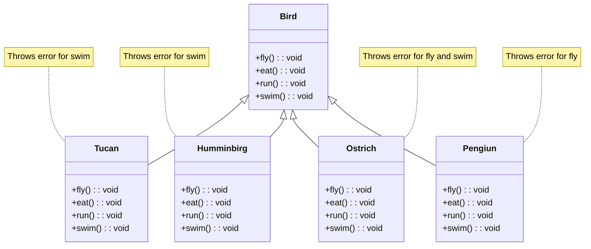

# 5 SOLID principles

## __Single Responsability (SRP)__

Is when we separate the responsibilities of each module. just keep in mind that `'single responsability' !== 'do more than one thing'`.

A good example would be this class that have too many responsibilities:

> [!NOTE]
> To clarify, `IProduct` is an `interface` in TS, not a class. I add it like that because that's the limitation that mermaid has right know if you want to make diagrams with TS. And `BLoC` means _Business Logic Component_.

Why do we have a `notifyClients()`? the class should only handle product responsibilities, and why `onAddToCart(productId: number)` is there? and what is we want to use the methods of `loadProduct(id: number)` and `saveProduct(product: Product)` somewhere else? That would cause a lot of issues in the future.

That's when when we use the SRP to separate responsibilities between our code.


You can see where that now `CartBloc` is being responsable to handle `onAddToCart()` and we even rename it to `addToCart()` to a single name since it's easier to understand under that context. Also `Mailer` is responsable to `notifyClients()` and we separated `ProductService` to make it easier to reuse somewhere else and not depend on `ProductBloc` for all our cases.

### How to know when is not being applied?
- Too generic names and very generic modules
- Changes in code that usually affect clases or modules
- Classes with multiple layers
- High number of importations
- High number of public methods
- Excessive number of code lines

## __Open/Closed Principle (OCP)__
This principle implies that software entities(clases, modules, methods, etc) __must be open for extension and close for modification__.  

In the next code we've classes consume data from an API, we've applied the SRP, so we've different services.
```ts
import { PhotosService, PostService, TodoService } from './services';

    const todoService = new TodoService();
    const postService = new PostService();
    const photosService = new PhotosService();

    const todos = await todoService.getTodoItems();
    const posts = await postService.getPosts();
    const photos = await photosService.getPhotos();
```
But the issue is that we're using a library to consume those endpoints, let's say we want to  migrate to fetch, we'd have to change every class. And let's say that maybe we want to comeback to `axios` again in the future so we'd have to implement it in very class again.

```ts
import axios from 'axios';

export class TodoService { 
    async getTodoItems() {
        const { data } = await axios.get('https://jsonplaceholder.typicode.com/todos/');
        return data;
    }
}

export class PostService {
    async getPosts() {
        const { data } = await axios.get('https://jsonplaceholder.typicode.com/posts');
        return data;
    }
}

export class PhotosService {
    async getPhotos() {
        const { data } = await axios.get('https://jsonplaceholder.typicode.com/photos');
        return data;
    }
}
```

So the solution would to create a separate class to implement our library.
```ts
import axios from "axios";

export class HttpClient {
  async get(url: string) {
    const { data, status } = await axios.get(`${url}`);
    return data;
  }
}
```

Now we use a DI (Dependency Injection) to also not make it tightly coupled and implement our `HttpClient`.

```ts
import axios from "axios";
import { HttpClient } from "./HttpClient";

export class TodoService {
  constructor(private http: HttpClient) {}

  async getTodoItems() {
    const { data } = await this.http.get(
      "https://jsonplaceholder.typicode.com/todos/"
    );
    return data;
  }
}

export class PostService {
  constructor(private http: HttpClient) {}

  async getPosts() {
    const { data } = await this.http.get(
      "https://jsonplaceholder.typicode.com/posts"
    );
    return data;
  }
}

export class PhotosService {
  constructor(private http: HttpClient) {}

  async getPhotos() {
    const { data } = await this.http.get(
      "https://jsonplaceholder.typicode.com/photos"
    );
    return data;
  }
}
```

We've to implement it when we instantiate a class. 
```ts
const http = new HttpClient();

const todoService = new TodoService(http);
const postService = new PostService(http);
const photosService = new PhotosService(http);
```

And now in the future we want to migrate to `fetch` we can do it very simple, like this.
```ts
export class HttpClient {
  async get(url: string) {
    const resp = await fetch(`${url}`);
    const data = await resp.json();

    return data;
  }
}
```

And our classes won't be affected by this change!! Since we applied a DI and we use `this.http.get` to consume the API.
```ts
constructor(private http: HttpClient) {}
```

```ts
const { data } = await this.http.get("some url");
```

Also we can conclude that SRP and OCP are very related.

### How to know when is not being applied?
- Changes usually affect our class or module
- When a class or module have a lot of layers. (Presentation, storage, etc) 

## __Liskov Substitution Principle (LSP)__
Being `U` a subtype of `T`, any instance of `T` should be substitute by any instance of `U` without altering the system properties. Basically `U ⊆ T`, and if you want to use an instance of `U` and `T` in `T` it's should work without altering its properties.

Keep in mind that the Liskov substitution principle it's about applying to types in more general context, not only inheritance. For example if we have the `interface Shape` that has an abstract function called `area(): number`. Now we can `implement` `Shape` to a class `Rectangle` with its own custom properties and just apply the contract; and same with other shapes like `Square`, and it's types are going to be the same for all shapes.
```ts
// Base Type: Shape
interface Shape {
  area(): number;
}

// Concrete Type: Rectangle
class Rectangle implements Shape {
  constructor(private width: number, private height: number) {}

  area(): number {
    return this.width * this.height;
  }
}

// Concrete Type: Square
class Square implements Shape {
  constructor(private side: number) {}

  area(): number {
    return this.side * this.side;
  }
}

// Function that uses Shape
function printArea(shape: Shape): void {
  console.log(`Area: ${shape.area()}`);
}

// Example usage
const shapes: Shape[] = [
  new Rectangle(5, 10),
  new Square(4),
];

shapes.forEach(shape => printArea(shape));
```

This is another example were we can use a __normal class__ for this principle.


```ts
  const bus: Vehicle = new Bus(100, 5000, "Back Left");
  const car: Vehicle = new Car(120, 3000, true);
```
But also we can use an __abstract class__ too

```ts
  const bus: Vehicle = new Bus(100, 5000, "Back Left");
  const car: Vehicle = new Car(120, 3000, true);
```

### How to know when is not being applied?
- When we modify parents original behavior.
  ```ts
  class Bird {
    fly(){
      console.log('Flying')
    }
  }

  class Penguin extends Bird {
    fly(){
      throw new Error(`Penguins can't fly`)
    }
  }
  ```

  When what we actually should to it's to use an abstract class and this even allow us to add more birds easily.
  ```mermaid
  classDiagram
    class Bird {
        <<abstract>>
        +fly(): void
    }

    class Sparrow {
        +fly(): void
    }

    
    class Penguin {
        +fly(): void
    }

    Bird <|-- Sparrow
    Bird <|-- Penguin
    ```

    ```ts
    abstract class Bird {
      abstract fly(): void; // Contract for flying birds
    }

    class Sparrow extends Bird {
      fly() {
        console.log('Sparrow flying');
      }
    }

    class Penguin extends Bird {
      fly() {
        console.log('Penguins cannot fly'); // Alternative behavior
      }
    }
    ```

- When we add additional restrictions to the code.
  ```ts
  class Car {
    drive(speed: number) {
      console.log(`Driving at ${speed} km/h`)
    }
  }

  class ElectricCar extends Car{
    drive(speed: number){
      if(speed > 120){
        throw new Error(`Electric cars cannot exceed 120 km/h`)
      }
      console.log(`Driving at ${speed} km/h`)
    }
  }
  ```
- When we add unexpected behavior to the child classes
  ```ts
  class Car {
    getNumberOfSeats(): number {
      return 5;
    }
  }

  class Audi extends Car {
    // Here it's being broken the principle, since broken the logic of the parent class
    constructor(private numberOfSeats: number, private musicSystem: string) {
      super();
    }

    getNumberOfSeats(): number {
      return this.numberOfSeats;
    }

    // Here too
    playMusic() {
      console.log(`Playing music: ${this.musicSystem}`);
    }
  }

  class Toyota extends Car {
    // Here it's being broken the principle, since broken the logic of the parent class
    constructor(private numberOfSeats: number, private wheels: number) {
      super();
    }

    getNumberOfSeats(): number {
      return this.numberOfSeats;
    }

    // Here too
    getWheels() {
      return this.wheels;
    }
  }
  ```

  It would be better just to implement an `abstract` class that makes certain behaviors optional.
  ```ts
    abstract class Car {
    abstract getNumberOfSeats(): number; // Make it an abstract method

    // Optional method to play music, so it's not mandatory for all cars
    playMusic?(): void; 
  }
  ```

## __Interface Segregation Principle (ISP)__
This principle reminds us to __no code should be forced to depend on methods that does not use__. Segregation means setting apart from other, and thats what we do the interfaces.

Here it's what happens to a lot of project, they keep scaling and we keep using the same interfaces; and if we don't refactor our interfaces we start to berk this principle.


Now this is when we apply `Interface Segregation Principle`.
```mermaid
classDiagram
    class Bird {
        +eat(): void
    }

    class FlyingBird {
        +fly(): void
    }

    class SwimmingBird {
        +swim(): void
    }

    class RunningBird {
        +run(): void
    }

    Bird <|-- Tucan
    FlyingBird <|-- Tucan
    RunningBird <|-- Tucan

    Bird <|-- Humminbirg
    FlyingBird <|-- Humminbirg

    Bird <|-- Ostrich
    RunningBird <|-- Ostrich

    Bird <|-- Pengiun
    SwimmingBird <|-- Pengiun

    class Tucan {
        +fly(): void
        +eat(): void
        +run(): void
    }

    class Humminbirg {
        +fly(): void
        +eat(): void
    }

    class Ostrich {
        +eat(): void
        +run(): void
    }

    class Pengiun {
        +eat(): void
        +swim(): void
    }
  ```

### How to know when is not being applied?
- If the interfaces we design make us break SRP and LSP.

## __Dependency Inversion Principle (DIP)__
> __“The Dependency Inversion Principle (DIP) tells us that the most flexible systems are those in which source code dependencies refer only to abstractions, not to concretions.”__  
> _— Robert C. Martin, *Clean Architecture: A Craftsman's Guide to Software Structure and Design*_

It states that high-level modules, which contain the core logic of the application, should not directly depend on low-level modules that perform specific tasks. Instead, both should depend on abstractions like interfaces. This separation of concerns allows developers to keep the complex parts of their code independent from the details of how specific tasks are accomplished, making it easier to adapt and change the system as needed.

Key concepts to understand here are that when we refer to an **abstraction**, we're talking about an `interface` or `abstract` class. In contrast, when we mention **concretions**, we mean the specific instances of classes created in our code, which can lead to high coupling between components. So It's better to use a __Dependency Inversion__ for those cases.

Here is an example of using `PostProvider` to be the important abstraction to be used in each or our `PosService` classes. Instead of having different function for each Service, which would cause high coupling and we would be depending upon a low-level dependency.
```mermaid
classDiagram
    direction TB

    class Post {
        +number id
        +string title
        +string body
        +number userId
    }

    class PostProvider {
        <<interface>>
        +getFakePosts(): Promise<Post[]>
    }

    class PostService {
        -Post[] posts
        +getPosts(): Promise<Post[]>
    }

    class LocalDataBaseService {
        +getFakePosts(): Promise<Post[]>
    }

    class JsonDataBaseService {
        +getFakePosts(): Promise<Post[]>
    }

    class ApiService {
        +getFakePosts(): Promise<Post[]>
    }

    PostService --> PostProvider : uses
    LocalDataBaseService ..|> PostProvider
    JsonDataBaseService ..|> PostProvider
    ApiService ..|> PostProvider

    PostService --> LocalDataBaseService : uses
    PostService --> JsonDataBaseService : uses
    PostService --> ApiService : uses
```

This means that instead of high-level components, like a `PostService`, directly depending on specific data providers (like `LocalDataBaseService`, `JsonDataBaseService`, or `ApiService`), they should depend on an abstraction, in this case, an interface called `PostProvider`. By doing this, the `PostService` can work with any implementation of `PostProvider`, allowing for greater flexibility and easier maintenance.

For instance, in a system that retrieves posts from various sources, the `PostService` relies on the `PostProvider` interface to fetch posts. Whether it’s pulling from a local database, a JSON file, or an API, the `PostService` remains agnostic to the specific details of these implementations. If a new source of posts is introduced, such as another API or a different database service, you can simply create a new class that implements `PostProvider` without modifying the `PostService`. 

### How to know when is not being applied?

- **High Coupling**: If high-level modules directly instantiate low-level modules, it's a clear indication that DIP is not being applied. For example, a service class creating instances of specific database classes indicates tight coupling.

- **Difficulty in Testing**: If writing unit tests for high-level modules is challenging due to dependencies on concrete implementations, this suggests a violation of DIP. Effective testing often requires mocks or stubs, which are easier with abstractions.

- **Frequent Changes Required**: If changing a low-level module necessitates modifications in high-level modules, this indicates that DIP is not utilized. A well-structured system should allow changes in low-level implementations without affecting high-level logic.

- **Poor Reusability**: When functionality in high-level modules is difficult to reuse across different contexts or applications, it may be due to tight coupling with specific low-level implementations.

- **Violation of Interface Segregation**: If modules depend on interfaces that are too broad or contain irrelevant functionality, it suggests that the principle is not being correctly applied. Each module should depend on a narrow interface tailored to its specific needs.

# Code smells
The are 6 smells to avoid; remember the acronym `STUPID`:
- __Singleton__ : Global context, untraceable, can be modified from anywhere, any time and it's hard to test.
- __Tight Coupling__ : High interconection, hard to test, hard to scale or modify.
- __Untestability__ : Not adding unittesting. Also it becomes hard to test when we've in your code high coupling, singleton and non DI(dependencies injections)
- __Premature optimization__ : It's better to keep the options open, don't anticipate to the requirements and don't add unnecessary abstractions. 
- __Indescriptible names__ : Don't bee too specific or too generic. Use the right names for what you want the class to do.
- __Duplicity__ : When you copy a lot of code it's a sign. Non using DRY, creates more human error, creates more testing for the same things, can lead to different behaviors with the same code accidentally because we modify some code and think it's also use in other places, where is not.

# Clean code
- Name correctly
- Use DRY
- Use single responsibility/reduce coupling

# Other smells
## Inflation  
- Use small functions instead of one big function
- Use small classes instead of one big class
- Primitive obsession instead of using a class/interface. This happens because the object grew too much.
- Long parameter list. Use submethods instead if these are required, like sending an object or multiple ones instead of multiple parameters.

## Couplers
- Feature envy. Change of place the attributes and methods.
- Don't use internal method or attributes of other classes.
- Chain of messages. It's when class `A` calls `B` to use the function of `C` to get the result of `A` again or `D`. Try to eliminate the communication between middle classes.
- Remove the middleman. It can happen in a incomplete refactorization or a bad design pattern.

# Project for Practice

This is a Vanilla TypeScript project in Vite, to work on exercises from the course on SOLID Principles and CleanCode.

Clone or download the project and then:

```
yarn install
or
npm install
```

To run the project, simply execute
```
yarn dev
or
npm run dev
```